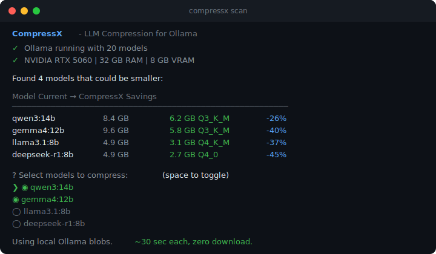
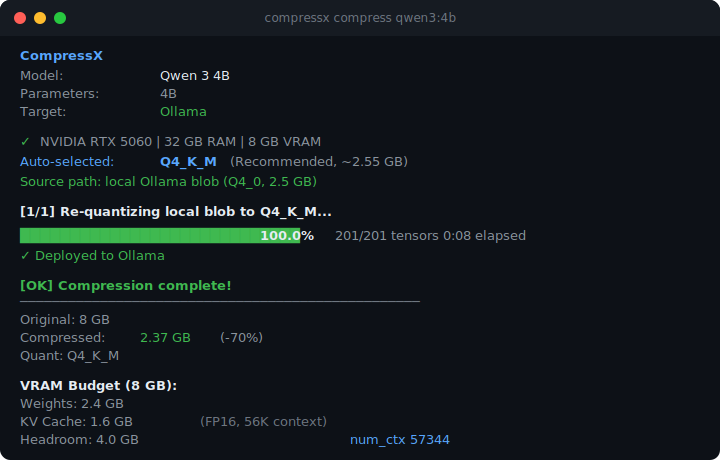
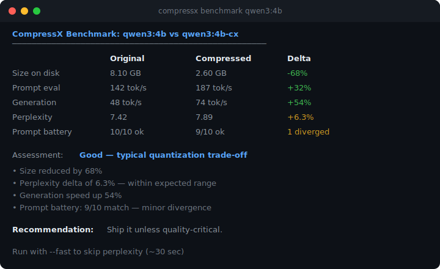

# CompressX

**Compress LLMs. Keep the originals. Deploy anywhere.**

CompressX is an open-source CLI that shrinks LLM models for any GGUF-compatible runtime. Source from Ollama or LM Studio, compress locally in ~30 seconds, deploy to Ollama, LM Studio, or as a raw GGUF file.

```bash
npm install -g compressx
```







## What's in this repo

| Directory | What it is |
|---|---|
| [`compressx-cli/`](./compressx-cli/) | The CLI tool (published to npm as `compressx`) |
| [`frontend/`](./frontend/) | Landing page at [compressx.asmith.media](https://compressx.asmith.media) |

## Quick Start

```bash
# Install
npm install -g compressx

# Scan and compress interactively
compressx

# Or compress a specific model
compressx compress qwen3:4b

# Benchmark before vs. after
compressx benchmark qwen3:4b
```

See the full docs in [`compressx-cli/README.md`](./compressx-cli/README.md).

## License

MIT - see [LICENSE](LICENSE).

---

**CompressX** - an [A. Smith Labs](https://asmith.media/labs) product

[Homepage](https://compressx.asmith.media) | [npm](https://www.npmjs.com/package/compressx) | [GitHub](https://github.com/asmithmedia/CompressX)
