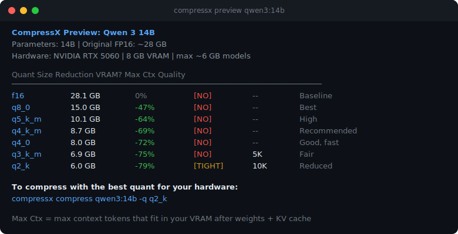

# CompressX

**Compress LLMs. Keep the originals. Deploy anywhere.**

One command to shrink LLM models for any GGUF-compatible runtime — Ollama, LM Studio, llama.cpp, Jan, GPT4All, Msty, text-generation-webui, and more. Originals stay intact — compressed versions get a `-cx` suffix.

```bash
npm install -g compressx
```

### Scan your library and compress interactively


### Compress with live progress bar and VRAM-optimized context


### Preview every quant level with max context per GPU



### Benchmark before vs. after with a color-coded verdict


## Quick Start

```bash
# Scan your Ollama library and suggest compressions
compressx

# Scan your LM Studio models directory
compressx scan --source lmstudio

# Preview all quant levels for any model without compressing
compressx preview qwen3:14b

# Compress a specific model to the auto-recommended quant level
compressx compress qwen3:4b

# Benchmark before vs. after (speed, perplexity, prompt battery)
compressx benchmark qwen3:4b

# Deploy to LM Studio instead of Ollama
compressx compress qwen3:4b --target lmstudio

# Just produce a GGUF file (for llama.cpp, Jan, GPT4All, Msty, etc.)
compressx compress qwen3:4b --target gguf

# Show your hardware
compressx hardware
```

After compression (Ollama, default target):

```bash
ollama list
#   qwen3:4b      5.2 GB   <- your original (untouched)
#   qwen3:4b-cx   2.4 GB   <- new, compressed by CompressX

ollama run qwen3:4b-cx
```

## Model Sources

CompressX can source models from Ollama or LM Studio using `--source`:

| Source | How it works |
|---|---|
| `ollama` *(default)* | Re-quantizes the GGUF blob already in your Ollama library (~30 sec, zero download) |
| `lmstudio` | Scans `~/.lmstudio/models/` for GGUF files and re-quantizes them directly |

```bash
# Scan LM Studio for compression candidates
compressx scan --source lmstudio

# Compress a model from your LM Studio library
compressx compress Qwen/Qwen3-4B --source lmstudio -q q3_k_m --target gguf
```

## Deployment Targets

Compress once, deploy anywhere. Choose your target with `--target`:

| Target | Where it puts the GGUF | Use for |
|---|---|---|
| `ollama` *(default)* | Registered as `<name>-cx` in your Ollama library | Ollama users |
| `lmstudio` | `~/.lmstudio/models/<Publisher>/<Repo>/<file>.gguf` | LM Studio users |
| `gguf` | Left in the `--output` directory | llama.cpp, Jan, GPT4All, Msty, text-gen-webui, koboldcpp, anyone else |

## Benchmarking

Compare original vs. compressed side-by-side with a color-coded verdict:

```bash
compressx benchmark qwen3:4b            # full: speed + perplexity + prompt battery
compressx benchmark qwen3:4b --fast     # skip perplexity (~30 sec)
compressx compress qwen3:4b --benchmark # benchmark immediately after compression
```

The benchmark measures:
- **Speed** — prompt eval and generation tokens/sec via llama-bench
- **Perplexity** — classical quality metric via llama-perplexity
- **Prompt battery** — 10 curated prompts sent to both models, responses compared with token-overlap similarity

Results are assessed as **Excellent** / **Good** / **Acceptable** / **Risky** with a plain-English recommendation.

## How It Works

1. **Scan.** `compressx` detects your GPU and RAM, queries your local Ollama (or LM Studio with `--source lmstudio`), and identifies models that could be smaller.
2. **Preview.** Run `compressx preview <model>` to see every quant level side-by-side with estimated size, compression ratio, and VRAM fit — no download, no compression.
3. **Compress.** By default, CompressX uses the GGUF file already in your library and re-quantizes it locally — **zero download, ~30 seconds for a 4B model**. If the model isn't installed locally (or you want pristine quality), it falls back to downloading the original weights from HuggingFace. Pass `--from-source` to force the fresh-download path.
4. **Deploy.** Hands the compressed file to your chosen runtime. Originals are never modified — compressed variants live alongside them with a `-cx` suffix.

### Local vs. Fresh-Source compression

| | Local (default) | `--from-source` |
|---|---|---|
| Speed | ~30 sec | ~3-10 min |
| Downloads | 0 bytes | Full model weights (~8-60 GB) |
| Quality | 1-3% more perplexity loss from double-quantization | Pristine, one-step quantization |
| Requires | Model already in Ollama or LM Studio | Python + `huggingface_hub` |
| Can upgrade quality? | No (can't go Q4 -> Q8) | Yes |
| Best for | Shrinking models you already have | First-time compression, pristine quality |

## Commands

| Command | Description |
|---|---|
| `compressx` | Scan Ollama library and interactively compress models |
| `compressx --all` | Show all installed models, including ones that already fit your hardware |
| `compressx scan --source lmstudio` | Scan LM Studio models directory for GGUFs to compress |
| `compressx preview <model>` | Preview every quant level for a model without compressing |
| `compressx compress <model>` | Compress a specific model with auto-recommended quant |
| `compressx compress <model> -q q4_k_m` | Compress with a specific quantization type |
| `compressx compress <model> --source lmstudio` | Re-quantize a model from LM Studio |
| `compressx compress <model> --from-source` | Download original weights from HuggingFace for pristine quality |
| `compressx compress <model> --target lmstudio` | Deploy to LM Studio instead of Ollama |
| `compressx compress <model> --target gguf` | Produce a plain GGUF file (any runtime) |
| `compressx compress <model> --benchmark` | Compress and immediately run a benchmark |
| `compressx benchmark <model>` | Full benchmark: speed, perplexity, prompt battery, verdict |
| `compressx benchmark <model> --fast` | Benchmark without perplexity (~30 sec) |
| `compressx hardware` | Show detected GPU, VRAM, RAM, and max model size |
| `compressx models` | List all supported models |
| `compressx update` | Update CompressX to the latest version |
| `compressx uninstall` | Remove CompressX data directory |

## Updating

```bash
compressx update
# or equivalently:
npm install -g compressx@latest
```

CompressX checks for new versions automatically once per day. Set `COMPRESSX_NO_UPDATE_CHECK=1` to opt out.

## Uninstalling

```bash
# macOS / Linux
curl -fsSL https://compressx.asmith.media/uninstall.sh | sh

# Windows
powershell -c "irm https://compressx.asmith.media/uninstall.ps1 | iex"
```

Or manually:
```bash
compressx uninstall          # removes ~/.compressx/ data
npm uninstall -g compressx   # removes the CLI binary
```

## Requirements

- **Node.js** 18 or later
- **Ollama** or **LM Studio** (at least one, for model sourcing)
- **llama.cpp** tools — auto-downloaded on first run, no manual setup needed
- **Python** 3.11+ with `huggingface_hub` (only for `--from-source` path)

## Supported Models

46 curated models + automatic fallback for any Ollama model with a size tag (`:4b`, `:14b`, `:8x7b`, etc.).

Families: Qwen 3 / 2.5 Coder, Gemma 3 / 2, Llama 3.1 / 3.2 / 3.3, Mistral / Mixtral, Phi-4 / Phi-3, DeepSeek R1 / Coder V2, CodeGemma, Code Llama, StarCoder 2, TinyLlama, SmolLM2, Granite 3.

Run `compressx models` for the full list.

## Supported Quantization Types

| Type | Quality | Size (7B model) |
|---|---|---|
| `f16` | Baseline | ~13 GB |
| `q8_0` | Excellent | ~7 GB |
| `q6_k` | Very High | ~5.5 GB |
| `q5_k_m` | High | ~5 GB |
| `q4_k_m` | **Recommended** | ~4 GB |
| `q3_k_m` | Fair | ~3 GB |
| `q2_k` | Reduced | ~2.5 GB |

## Contributing

CompressX is MIT licensed and open source. Contributions are welcome.

```bash
git clone https://github.com/asmithmedia/CompressX.git
cd CompressX/compressx-cli
npm install
npm test        # 97 tests
npm run dev     # run from source
npm run build   # production build
```

## License

MIT - see [LICENSE](LICENSE).

---

**CompressX** - an [A. Smith Labs](https://asmith.media/labs) product

[Homepage](https://compressx.asmith.media) | [npm](https://www.npmjs.com/package/compressx) | [GitHub](https://github.com/asmithmedia/CompressX)
